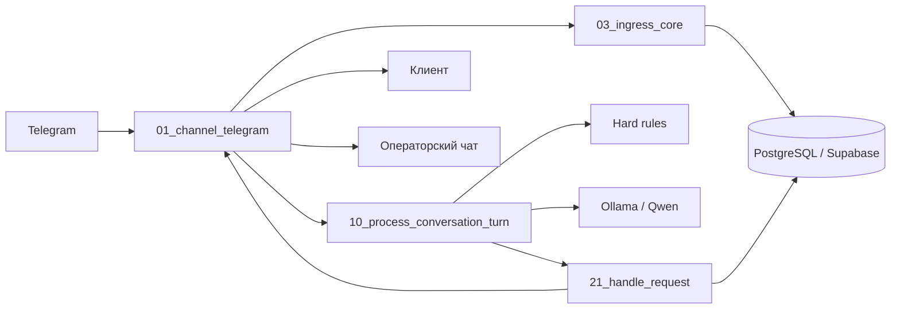

# AI Front Office для сервисного бизнеса

Портфолио-проект на **n8n + PostgreSQL/Supabase + Telegram + Ollama**, который принимает обращения клиентов, собирает обязательные данные, определяет услугу, предлагает свободное время, удерживает слот и создаёт заявку. Нестандартные, опасные и спорные ситуации передаются сотруднику с контекстом.

> Статус: **готовый демонстрационный MVP**. Основной путь заявки, операторский handoff, unsafe-сценарий, изменение существующей заявки и неподдерживаемые типы сообщений проверены вручную на демо-данных.

## Какую проблему решает

В сервисном бизнесе менеджер обычно вручную:

- читает входящее сообщение;
- уточняет неисправность, адрес и телефон;
- сопоставляет запрос с услугой;
- ищет свободное время;
- переносит данные в учётную систему;
- разбирает опасные и нестандартные обращения.

Система автоматизирует стандартный путь и оставляет сотруднику только исключения.

## Было / стало

| Было | Стало |
|---|---|
| Заявки разбросаны по сообщениям | Каждое обращение фиксируется в PostgreSQL |
| Менеджер задаёт одинаковые вопросы вручную | Бот детерминированно запрашивает недостающие поля |
| Услуга и слот выбираются вручную | Каталог услуг, правила и LLM помогают выбрать услугу и время |
| Возможны дубли при повторном нажатии | Входящие события и ответы имеют идемпотентные контракты |
| Опасные ситуации могут попасть в обычную очередь | Дым, искрение, запах гари и удар током сразу уходят в unsafe-handoff |
| После передачи сотруднику теряется контекст | Оператор получает карточку обращения и активные заявки клиента |

Экономический эффект в репозитории показан только как **сценарная модель**, а не как подтверждённый результат реального клиента: [docs/business-effect.md](docs/business-effect.md).

## Что умеет MVP

- принимает Telegram-сообщения и callback-кнопки;
- нормализует вход в единый `envelope`;
- защищается от повторной обработки одного Telegram update;
- хранит клиентов, диалоги, сообщения, черновики и заявки в PostgreSQL;
- извлекает поля обращения через правила и локальную LLM;
- определяет услугу по детерминированным подсказкам и LLM;
- запрашивает только недостающие данные;
- проверяет зону обслуживания;
- предлагает слоты и создаёт временный hold;
- показывает клиенту итоговую карточку;
- создаёт заявку после подтверждения;
- передаёт обращение оператору;
- обрабатывает кнопки «Закрыть обращение» и «Вернуть боту»;
- показывает оператору активные заявки клиента при запросе на изменение;
- обрабатывает unsafe-сигналы;
- отвечает на voice/photo/document/location единым безопасным сообщением;
- сохраняет статус доставки исходящих сообщений.

## Архитектура



Подробно: [docs/architecture.md](docs/architecture.md).

## Состав репозитория

```text
.
├── workflows/
│   ├── 01_channel_telegram.json
│   ├── 03_ingress_core.json
│   ├── 10_process_conversation_turn_STABLE.json
│   └── 21_handle_request_STABLE.json
├── docs/
│   ├── architecture.md
│   ├── business-effect.md
│   ├── data-contract.md
│   ├── deployment.md
│   ├── demo-script.md
│   ├── limitations.md
│   └── test-cases.md
├── examples/
│   ├── demo-transcript.md
│   ├── delivery-command.json
│   └── envelope.json
├── sql/
│   ├── README.md
│   └── export_required_database_objects.sql
├── SECURITY.md
├── CHANGELOG.md
└── README.md
```

В корне также сохранён статический демонстрационный сайт (`index.html`, `styles.css`, `script.js`).

## Стек

- n8n;
- PostgreSQL / Supabase;
- Telegram Bot API;
- Ollama;
- `qwen2.5:7b`;
- Docker Desktop.

В четырёх workflow — **95 нод**. Бизнес-состояния и атомарные изменения хранятся в PostgreSQL, а n8n отвечает за оркестрацию, валидацию, LLM-вызовы и доставку.

## Быстрый запуск

Полная инструкция: [docs/deployment.md](docs/deployment.md).

Краткий порядок:

1. Развернуть n8n, PostgreSQL/Supabase и Ollama.
2. Подготовить таблицы и SQL-функции из раздела [sql/README.md](sql/README.md).
3. Импортировать workflow в порядке:
   1. `03_ingress_core`;
   2. `21_handle_request_STABLE`;
   3. `10_process_conversation_turn_STABLE`;
   4. `01_channel_telegram`.
4. Создать Postgres и Telegram credentials.
5. Повторно выбрать дочерние workflow в нодах `Execute Sub-workflow`.
6. В `02 Channel Configuration` указать tenant, Telegram-чат операторов и разрешённые user ID.
7. Проверить доступ n8n к Ollama по адресу `http://host.docker.internal:11434`.
8. Опубликовать workflow и прогнать smoke-тесты.

Экспортированные JSON очищены от credential ID, instance ID и реальных Telegram ID. После импорта credentials и ссылки на sub-workflow нужно назначить заново.

## Основной сценарий

```text
Клиент:
«Кондиционер Haier не охлаждает. Зеленоград, корпус 458.»

Система:
1. создаёт/находит клиента и conversation;
2. извлекает проблему, оборудование, бренд, город и корпус;
3. сопоставляет обращение с услугой;
4. проверяет обязательные поля и зону;
5. предлагает свободные слоты;
6. удерживает выбранный слот;
7. показывает карточку подтверждения;
8. после подтверждения создаёт заявку;
9. отправляет оператору уведомление.
```

Пример диалога: [examples/demo-transcript.md](examples/demo-transcript.md).

## Надёжность

В проекте применены:

- единый входной контракт;
- параметризованные SQL-запросы;
- idempotency по внешнему событию и исходному сообщению;
- optimistic concurrency через `conversation.version`;
- `SELECT ... FOR UPDATE` внутри SQL-функций;
- отдельные статусы обработки и доставки;
- проверка длины Telegram `callback_data`;
- освобождение hold при отмене или возврате;
- сохранение операторского handoff;
- безопасный возврат боту с очисткой старого черновика.

## Проверенные сценарии

1. Полный happy path до созданной заявки.
2. Последовательный сбор недостающих полей.
3. Выбор и удержание слота.
4. Запрос живого сотрудника.
5. Unsafe: дым, искрение, запах гари.
6. Изменение существующей заявки с выводом активных заявок.
7. Возврат обращения боту с чистым новым черновиком.
8. Неподдерживаемый формат сообщения без зависания в `processing`.

Подробности: [docs/test-cases.md](docs/test-cases.md).

## Границы MVP

Сознательно не реализованы:

- FAQ/RAG;
- самостоятельный статус заявки;
- автоматическое изменение выбранной существующей заявки;
- распознавание голоса, фото и документов;
- полноценный redelivery-worker;
- мониторинг и алерты production-уровня;
- универсальная поддержка нескольких каналов;
- готовый публичный SQL dump.

Полный список: [docs/limitations.md](docs/limitations.md).

## Безопасность

Не публикуйте:

- Telegram bot token;
- пароль PostgreSQL;
- Supabase service-role key;
- реальные chat/user ID;
- выгрузки сообщений клиентов;
- production URL и приватные HTTP headers.

См. [SECURITY.md](SECURITY.md).

## Автор

**VanilVibecoder** — n8n / AI-автоматизации для сервисного и B2B-бизнеса.

Стоимость внедрения определяется после разбора процесса и объёма интеграций.
