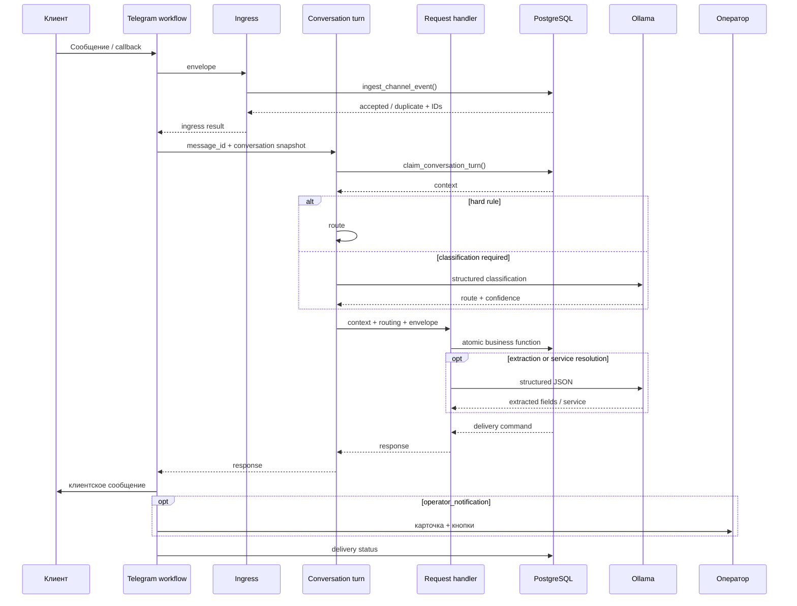
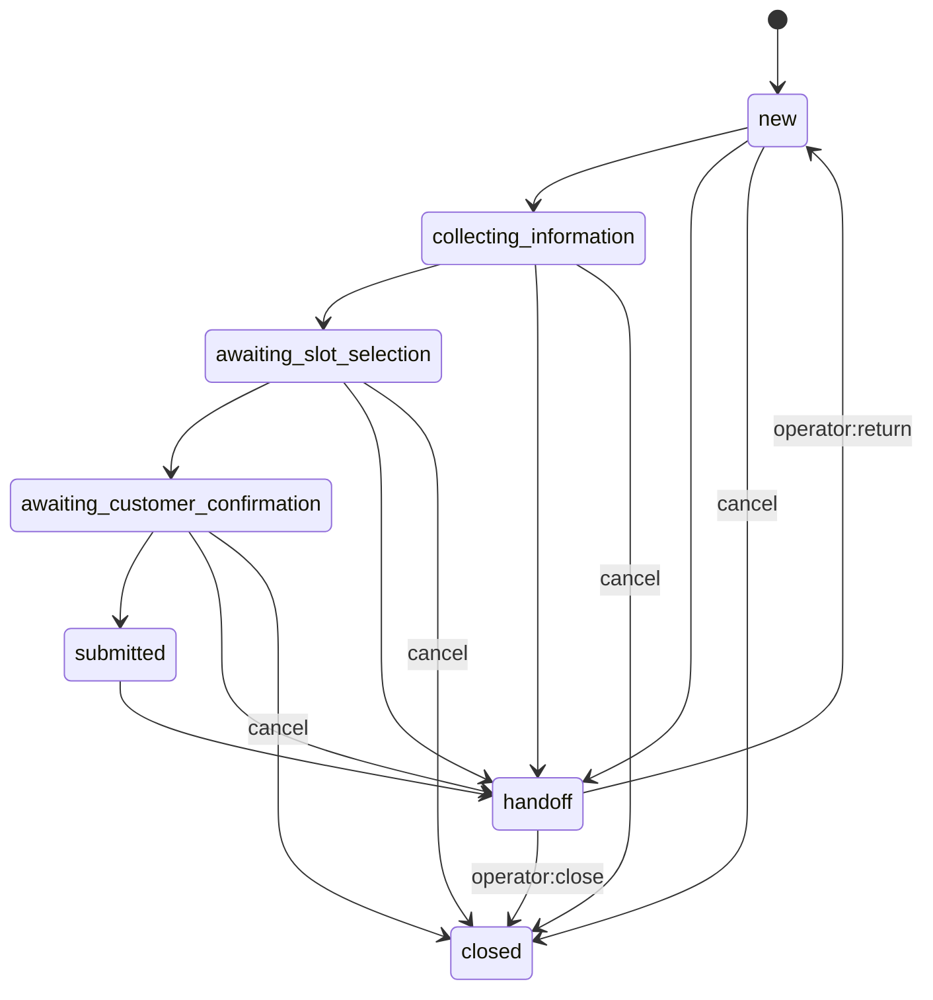

# Архитектура

## 1. Архитектурные блоки

### `01_channel_telegram`

Канальный адаптер:

- принимает Telegram update;
- отличает клиента от оператора;
- нормализует text/contact/callback/voice/photo/document/location;
- создаёт единый `envelope`;
- вызывает ingress и conversation engine;
- валидирует delivery command;
- отправляет клиентское сообщение;
- обновляет `delivery_status`;
- отправляет операторскую карточку;
- обрабатывает операторские callback-команды.

### `03_ingress_core`

Атомарный вход:

- валидирует контракт;
- вызывает `ingest_channel_event`;
- создаёт или находит customer/conversation/message;
- дедуплицирует событие по `external_event_id`;
- возвращает snapshot состояния.

### `10_process_conversation_turn_STABLE`

Оркестратор хода:

- claim сообщения;
- загрузка актуального контекста;
- hard rules;
- LLM-классификация только когда правил недостаточно;
- маршрутизация unsafe, handoff, change, active request и unsupported input;
- вызов request handler;
- возврат единого delivery command.

### `21_handle_request_STABLE`

Бизнес-обработчик:

- определяет action;
- извлекает и валидирует поля;
- объединяет черновик атомарной SQL-функцией;
- загружает каталог;
- выбирает услугу;
- проверяет обязательные поля;
- создаёт clarification;
- предлагает и удерживает слот;
- подтверждает или отменяет заявку;
- переоткрывает черновик;
- создаёт handoff.

## 2. Поток данных

## 3. Машина состояний

## 4. Где правила, LLM и человек

| Задача | Механизм |
|---|---|
| Telegram contract, callback, состояния | Детерминированные правила |
| Unsafe-сигналы | Regex / hard rules |
| Явный запрос оператора | Hard rules |
| Изменение существующей заявки | Hard rules |
| Извлечение нескольких полей из свободного текста | LLM + строгая JSON-схема |
| Извлечение одного ожидаемого поля | Детерминированно |
| Выбор услуги по точным `matching_hints` | Детерминированно |
| Неоднозначный выбор услуги | LLM + каталог |
| Низкая уверенность, неподдерживаемая услуга | Человек |
| Изменение одной из нескольких активных заявок | Человек |

## 5. Состояние и конкурентность

Источник истины — PostgreSQL:

- `conversations.state`;
- `conversations.version`;
- `conversations.pending_action`;
- `conversations.draft_payload`;
- `conversations.booking_snapshot`;
- статусы `messages.processing_status` и `messages.delivery_status`.

SQL-функции блокируют критические строки и сравнивают ожидаемую версию. Устаревший ход возвращает `superseded`, а повторная доставка использует уже созданный outbound message.

## 6. Основные сущности

- `organizations`;
- `customers`;
- `conversations`;
- `messages`;
- `service_catalog`;
- `service_areas`;
- `availability_slots`;
- `slot_holds`;
- `service_requests`.
